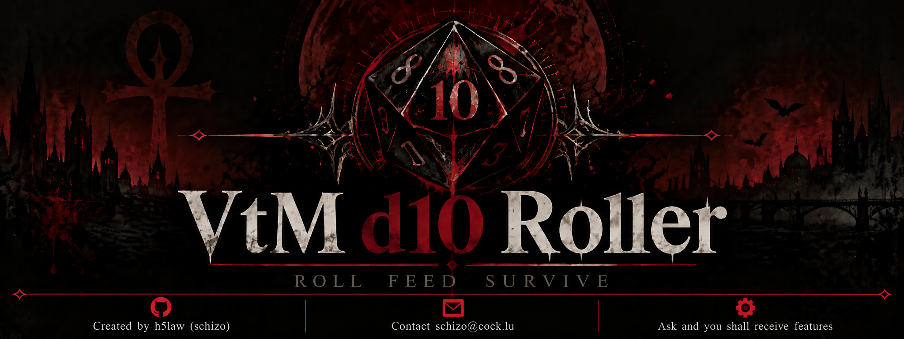

<p align="center">
  
</p>

# VtM d10 Roller

VtM d10 Roller.

A simple Firefox extension for rolling d10 dice pools for **Vampire: The Masquerade**.

A lightweight d10 roller for **Vampire: the Masquerade**. Build pools, set difficulty and thresholds, roll instantly, and track criticals, messy criticals, successes, and failures throughout your session.

## Add-on Official Site

The add-on/extension will be available at:
<a
href="https://addons.mozilla.org/fr/firefox/addon/vtm-d10-dice-roller/">Mozilla
Extensions Store</a>
once it has been digitally signed off by Mozilla (IN-PROGRESS). Which will mean
it can be installed like any other Add-on. Until then it must be installed in
development mode, instructions are below.

## Demo

https://github.com/user-attachments/assets/43d60000-5c7d-4fe7-a4f5-9e4bf75358d7

## Features

- Add dice to your pool with a single click.
- Configure the **Success Threshold** and **Difficulty**.
- Automatically calculate successes.
- Supports critical and messy critical results.
- Supports bestial and messy failures.
- Tracks cumulative roll statistics for the current session.
- Reset the pool and statistics at any time.
- Runs entirely locally with no tracking or data collection.

## VTM Rules

- A die is a success when it meets or exceeds the Success Threshold.
- A roll succeeds when successes are greater than or equal to the Difficulty.
- Every pair of 10s counts as **4 successes**.
- A single 10 counts as **1 success**.
- Therefore:
- 1 ten = 1 success
- 2 tens = 4 successes
- 3 tens = 5 successes
- 4 tens = 8 successes
- ...

- One 10 on a winning roll is a **Messy Critical**.
- Two or more 10s on a winning roll is a **Critical Win**.
- One 1 on a failed roll is a **Messy Failure**.
- Two or more 1s on a failed roll are a **Bestial Failure**.

## Usage Guide

To install follow the following excerpt from the `README.md`:

The extension can be installed from Firefox's Add-ons manager once signed by Mozilla, but until it's approved or if you want the latest release load it temporarily through:

*about:debugging* → **Add-ons and Extensions** → **Load Add-on From File**.

### `manifest.json` - From Source

https://github.com/user-attachments/assets/7d21d559-1884-4eb6-b59c-48448cef77d5

### `vtm-d10-roller.zip` - From Release Object

https://github.com/user-attachments/assets/f8edab0f-a3c3-4b60-bee2-d5efe2fefe65

## Feedback

Please don't hesitate to give any and all feedback, suggestions and anything else to the email for this project <a href="mailto:schizo@cock.lu">schizo@cock.lu</a> which will reply with clear-signed plain-text messages using the same key signing the commits for proof of ownership.

If email isn't your *style*, please leave a GitHub issue with a bug, or feature request and I will get around to it ASAP (bear in mind there is one of me).

## Bugs, Features and Tickets

Please post any and all issues or feature requests you may have in the relevant GitHub area, or hit my email <a href="mailto:schizo@cock.lu">schizo@cock.lu</a> , and they will be addressed as soon as possible.

## Files

```text
├── dice.png
├── banner.png
├── manifest.json
├── popup.html
├── popup.css
├── popup.js
├── README.md
└── LICENSE
```
